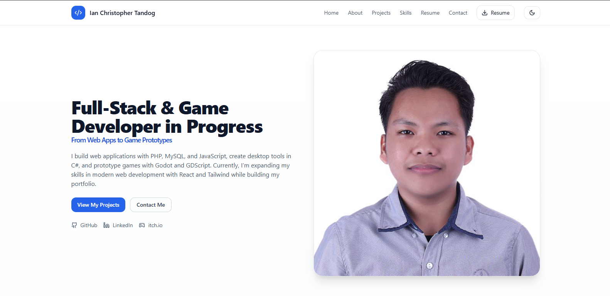

🌐 Ian Christopher Tandog – Web Portfolio

A personal portfolio website built with React + Tailwind CSS showcasing my projects, skills, and contact information.

🔗 Live Demo: ianchristophertandog.github.io/web-portfolio

🚀 Features

Clean and responsive design (mobile-first)

Dark / Light mode support

Projects showcase with demo and code links

Contact form with mailto: support

Social media links for easy connection

🛠️ Tech Stack

Frontend: React, Tailwind CSS

UI Components: shadcn/ui, lucide-react

Deployment: GitHub Pages 

📂 Project Structure src/ ├── components/ # Reusable UI components (Button, Card, Chip, etc.) ├── assets/ # Images, icons, favicon ├── App.jsx # Main app file └── data/ # Project and socials data

📸 Preview

📸 Preview  

📬 Contact

Email: ictandog37@gmail.com

LinkedIn: www.linkedin.com/in/ian-christopher-tandog-8a366b202

GitHub: @IanChristopherTandog